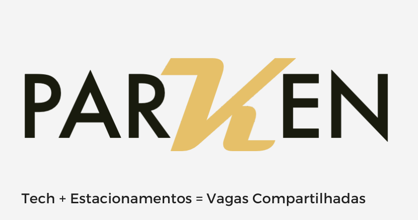
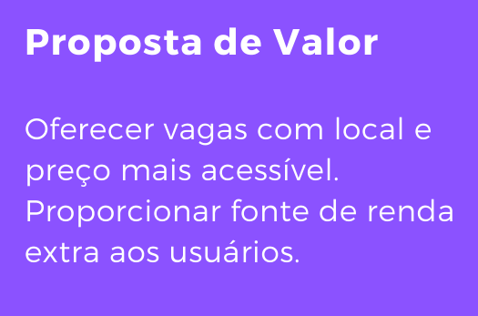

# KrakenStartup



KrakenStartup is a robust and scalable built with ASP.NET Core that is under development for completion of my Information Systems College at FIAP and based on the principles of Domain-Driven Design (DDD). It provides a solid foundation for developing modern web applications, with a clean and layered architecture that promotes separation of concerns and maintainability.




## Features

*   **Layered Architecture:** Follows a clean, domain-driven architecture to separate business logic, application services, and data persistence.
*   **Modularity:** Built on a modular structure that allows for easy extension and customization.
*   **Authentication & Authorization:** Comes with a pre-configured identity module for user management.
*   **Localization:** Supports multi-language applications with built-in localization.
*   **Dependency Injection:** Fully integrated with ASP.NET Core's dependency injection framework.

## Technology Stack

*   **.NET 6+**
*   **ASP.NET Core**
*   **Entity Framework Core**
*   **SQL Server**
*   **Bootstrap**
*   **jQuery**

## Project Structure

The solution is organized into the following projects, each with a distinct responsibility:

*   `KrakenStartup.Core`: The domain layer, containing entities, value objects, and core business logic. This is the heart of the application.
*   `KrakenStartup.Application`: The application layer, which orchestrates the domain logic through application services. It acts as a bridge between the presentation layer and the domain.
*   `KrakenStartup.EntityFrameworkCore`: The infrastructure layer responsible for data persistence using Entity Framework Core.
*   `KrakenStartup.Web`: The presentation layer, an ASP.NET Core web application that hosts the user interface.
*   `KrakenStartup.Tests`: Unit and integration tests for the application and domain layers.
*   `KrakenStartup.Web.Tests`: Tests for the web layer, including controllers and UI components.

## Getting Started

To get the project up and running on your local machine, follow these steps:

### Prerequisites

*   **Visual Studio 2022** or later
*   **.NET 6 SDK** or later
*   **SQL Server**

### Installation

1.  **Clone the repository:**
    ```bash
    git clone https://github.com/JulioCesar82/kraken-startup-server.git
    cd kraken-startup-server
    ```

2.  **Configure the database:**
    *   Open `src/KrakenStartup.Web/appsettings.json`.
    *   Update the `Default` connection string to point to your SQL Server instance.

3.  **Run the application:**
    *   Open the `KrakenStartup.sln` file in Visual Studio.
    *   Set `KrakenStartup.Web` as the startup project.
    *   Build the solution to restore all dependencies.
    *   Run the application (F5).

## Contribution Guidelines

We welcome contributions from the community! To contribute, please follow these steps:

1.  **Fork the repository.**
2.  **Create a new branch** for your feature or bug fix: `git checkout -b feature/your-feature-name`.
3.  **Make your changes** and ensure they adhere to the project's coding standards.
4.  **Write tests** for your changes to ensure they are working correctly.
5.  **Submit a pull request** with a clear description of your changes.

We appreciate your help in making this project better!
